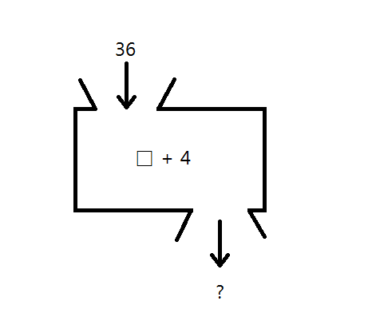

# 함수의 기초

우리는 중, 고등학교 수학 교과 과정에서 함수라는 것을 배워보았을것이다. 가장 기초적인 형태가 `y=f(x)`라고 기억할탠데, `f`라는 함수에서 `x` 인자를 넣어서 `y`라는 값을 반환하는 것처럼, 프로그래밍에서 '함수'도 역시 비슷한 형태로 생각하면 된다. 위 11번째 줄의 `printf()`도 역시 함수로, 괄호 안의 인자를 대입하여 결과를 내보낸다. 이때 수학에서의 함수와는 다르게 변수 y 선언이 선택적이다.

| 함수의 종류 | 표현방법 | 함수 이름 | 대입값 (매개변수) | 반환값 |
|:--------:|:------:|:-------:|:-------------:|:----:|
| 수학에서 | `y = f(x)` | `f` | `x` | `y` |
| 컴퓨터 프로그래밍 | `int main(void)` | `main` | `void` | `int` (정수) |

프로그래밍에서의 함수를 실행하는 것을 **호출한다**라고 하는데, 함수를 호출할 때에는 `hello_world.c`의 [11번째 줄](hello_world.c#L11)처럼 사용하면 된다.

수학에서의 함수와 같이, 함수이름을 쓰고 괄호 안에 대입값(프로그래밍에서는 이를 '매개변수'라 한다.)을 넣으면 함수를 호출하는 것이다.

주목해야 할 점은, 수학에서의 함수와는 다르게 프로그래밍에서의 함수는 **대입값(매개변수)와 반환값이 없을 수도 있다**. 수학에서의 함수는 위 사진과 같이 대입값과 반환값이 항상 존재했었지만, 프로그래밍에서의 함수는 매개변수 없이 스스로 호출될수도 있고, 호출되어도 반환값이 없이 깔끔히 끝나는 경우도 있다. 프로그래밍에서 중요한 점은 **박스 안**이다. 반환 값이 없거나 매개변수가 없어도 프로그래밍에서 함수의 역활은 `{}` 안에 정의되어져 있는 명령을 실행하는 것이다.

자세한 이야기들은 10장에서 다룰 예정이다.
