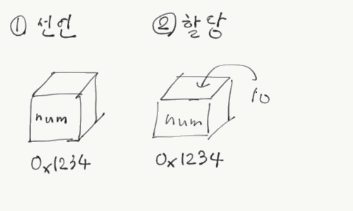
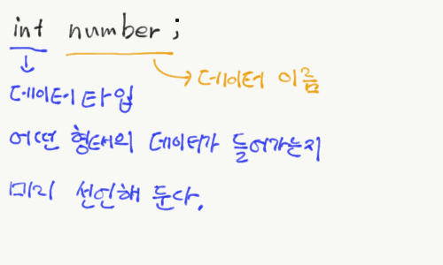
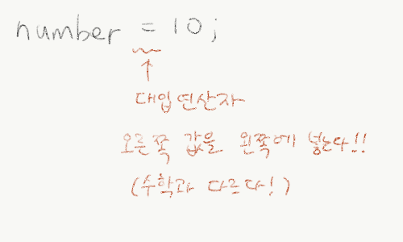
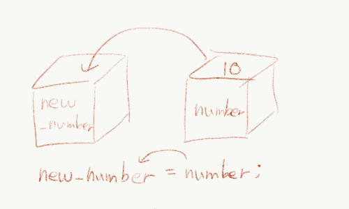

## 변수의 기초

데이터(자료)를 저장하고 활용하는 방법을 알아보자.
수학에서의 미지수처럼, 프로그래밍에서는 자료를 저장할 때 **변수**를 활용한다.
기본적으로 변수를 만드는 방법은 다음과 같다.

```c
int number;
number = 10;
```

첫번째 줄은 _**변수를 선언한다**_ 라고 이야기하고, 두번째 줄은 변수에 값(데이터, 자료)을 _**할당한다**_ 라고 이야기한다.




이 과정은 위 사진과 같이 설명할 수 있다. 선언 과정을 통해 `number`이라는 이름의 상자를 하나 만든다고 생각하자. 이때 그 상자의 위치를 가리키는 주소도 같이 생성된다고 생각하자. (주소에 관련된 자세한 이야기는 11장 - 메모리와 포인터에서 다룰 예정이다. 지금은 '주소가 있구나~'정도만 생각해두자.) 이후 할당 과정을 통해 데이터 값이 `number`라는 상자 안에 들어간다고 생각하자.



변수를 선언할때에는, 변수의 데이터타입(자료형)과 변수의 이름을 적는다. 데이터타입에 대한 자세한 이야기는 [data_type.c](data_type.c)를 참고하자. 변수의 이름을 정할 때에는 다음과 같은 규칙이 존재한다.


### 변수 네이밍 규칙

1. 오로지 영문 대/소문자, 숫자, `_`(밑줄 문자)만 사용 가능하다. 이외 문자는 불가능하다. (특수기호 불가능)
2. 첫 글자는 숫자가 될 수 없다.
3. 이름 중간에 공백 문자(스패이스바)를 넣으면 안된다.
4. C 언어 예약어를 사용하면 안된다.
    예약어는 이후 기본 문법을 배울때 배울 명령어들이다. 이는 변수 이름을 짓던, 함수 이름을 짓던 사용하면 안된다.
    예약어 목록은 [여기](http://araikuma.tistory.com/536)를 참고하자.

또한 책에서는 변수의 이름을 지정할 때 조언하는 사항들을 적어두고 있다. 너무 긴 이름, 용도에 맞지 않는 이름, 의미없는 이름은 짖지 않는 것이 좋다.



변수를 할당할때에는, C언어에서도 중요하고 프로그래밍 전체적으로 중요한 연산자가 하나 나온다. 수학에서 등호(=)는 주로 항등식을 표현하거나 방정식에서 왼쪽과 오른쪽이 '같다'를 표현하기 위해 사용한다. 다만, 프로그래밍에서 등호는 다르다. **오른쪽에 있는 값을 왼쪽에 대입하는** 연산자인 것이다. 이를 **대입 연산자**라고 한다. 그러면 맨 처음 사진이 이해될 것이다. 오른쪽 값인 10을 왼쪽에 있는 `number`라는 변수에 넣는 것이다. 그러면 조금의 연습을 해 보자.

```c
int number;
number = 10;
int new_number;
new_number = number;
```

이런 코드에서 `new_number`의 값은 어떻게 될까? 잠깐 고민해보자. 답은 10이다. 2번째 줄에서 `number`에 10을 저장했으니, 4번째 줄에서는 `new_number`에 `number`의 값(10)을 넣어야 함으로 10이 저장된다.



추가적으로 이런 코드도 가능하다.

```c
int my, name, is, sungwoo;
int we = 1, can, doit = 3;
```

여러 변수를 한꺼번에 선언도 가능하고, 여러 변수를 한꺼번에 선언도 하면서 할당할 수도 있다. 이때 주의해야 할 점은, 쉼표(,)로 연결된 변수들은 다 같은 데이터 타입을 가진다는 것이다. `name`, `is`, `sungwoo` 역시 int형 변수인 것이다.
