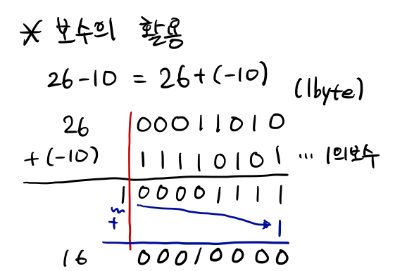

# 자료형에 대한 사소하지만 사소하지 않은 사실들

컴퓨터의 사양의 한계가 있듯이 각각의 변수에도 저장할수 있는 데이터 크기의 한계가 존재한다. 이를 이해하기 이전에 컴퓨터에서 어떻게 변수에 데이터를 저장하는지부터 알아야 한다.

## 데이터 저장 방법 (약간의 컴퓨터구조개론)

우리는 10, 20, 425와 같은 10진수와 영어, 한국어등 다양한 문자를 사용하며 데이터(자료)들을 인식하지만 컴퓨터는 그렇지 않다. 컴퓨터 구조상 컴퓨터에서는 0과 1, **2진수**로밖에 저장을 할 수가 없다. 그러한 상태에서 2진수나 정수를 저장하는 것은 문제가 없겠지만, 실수(소수가 존재하는)나 문자를 저장할 때에는 문제가 발생한다. 과연 어떻게 저장해야 여러 데이터을 저장할 수 있을까? 이를 고민하다가 나온 개념이 부동소수점과 보수, ASCII, 데이터 타입(자료형) 등이 있다.

### 부동소수점

정수 데이터는 10진수를 2진수로 바꾸어 어찌저지 저장할 수가 있다. 다만 소수가 있는 실수는? 이를 어떻게 바꿔야 할까? 이를 표현하기 위해선 유효숫자 개념을 이해해야 한다.

유효 숫자란 '실제 의미있는 숫자'를 의미한다. 예를 들어보자. 내가 손으로 집을 수 있는 쌀알을 다 세어보니 약 4300알이라고 하자. 이때 '실제 필요한 숫자'는 4와 3이다. 그 뒤 0 2개는 숫자의 자릿수를 표현하기 위한 숫자이지 실제 의미가 있다고 하진 않기 때문이다. 물론 여기서 더 자세히 들어갈 수도 있지만, 여기서 넘어가도록 하자.

그러면 소수 데이터 저장 방법과 유효 숫자와는 어떤 관계가 있을까? 예를 들어 소수 0.000245라는 숫자를 저장한다고 해보자. 여기에서 유효 숫자는? 2, 4, 5이다. 이를 깔끔하게 유효숫자만 표현하기 위해 로 표현한다. 이러한 표현 방법을 **부동소수점 표현**이라고 한다. 결과적으로, 컴퓨터에서는 소수를 부동소수점 표현으로 변경하여 유효숫자와 10의 지수만 저장한다. 이 둘은 무조건 정수(유효숫자는 항상 X.XX...로 표현되기 때문에 XXX... 정수로 변형하여 저장할 수 있다. 어차피 맨 처음 자리의 숫자가 정수부분이고 이후가 소수부분은 동일하다.)로 표현 가능함으로 2진수로 저장하게 된다.


### 보수와 오버플로우

갑자기 뜬금없는 이야기이긴 하지만, C언어에서는 사칙연산을 어떻게 구현할까? 우리가 곱셈과 나눗셈을 배울 때에는, 덧셈과 뺄셈의 연속이라고 배웠다.


그러면 사칙연산을 구현한다고 하면, 덧셈과 뺄셈만 만들어놓으면 곱셈과 나눗셈은 덧셈과 뺄셈으로 구현할 수 있다. 이때 '보수'의 개념을 도입하면 뺄셈 또한 덧셈으로 구현할 수 있게 되어, 덧셈 하나면 사칙연산을 구현할 수 있다. 보수란 무엇일까? 수학에서의 보수란 (주로 n의 보수라고 이야기한다) n이 되기 위해서 필요한 수를 의미한다. 예를 들어 40의 50의 보수는 10이고, 3의 10의 보수는 7이다.

프로그래밍에서는 보수의 개념이 살짝은 다르다. 처음으로, 1의 보수는 숫자를 2진수로 바꾸었을 때 0을 1, 1을 0으로 바꾼 숫자이다.


그러면 보수 개념이 어떻게 뺄셈을 대체할수 있는 것일까? 가장 중요한 것은, 양수의 보수는 절댓값이 같은 음수라는 것이다. 예시에 적은 10의 1의 보수는 -10을 의미하고, 26의 1의 보수는 -26인 것이다.

본격적으로 뺄셈을 해 볼까?



간단한 수식 26-10을 보수를 활용해보자. 사실 저 식은 26+(-10)으로 대체할 수 있다. 그렇기 때문에 보수가 뺄셈을 대체할수 있다는 것이다. 보수는 음수를 표현하는 방식이기 때문에 저 식을 활용해도 컴퓨터에서는 계산이 가능하기 때문이다.
이후 덧셈은 간단하다. 1과 0을 더하면 당연히 1이고 1과 1을 더했을 때에는 올림을 해 계산을 마친다. 만약 덧셈이 저장 범위에 넘어가면 (위 예시는 1byte = 8bit = 8자리가 최대라고 생각하자) 이를 가장 낮은 자릿수에 더해준다. (파란색 과정) 결국 우리가 원하는 결과값인 16이 나온다.

하지만 1의 보수에서는 두가지 단점이 존재한다. 첫째로, 0이 총 2가지가 존재한다. 원래 0인 0000 ... 0000의 보수는 1111 ... 1111인데, 이는 -0, 다시말해 보수 역시 0이다. 같은 숫자가 두가지 표현방식이 존재하면 오류가 발생할 수 있다. 둘째로, 계산 과정에서 데이터 범위가 넘어가는 경우가 발생한다. 처음에서 언급했다싶이 컴퓨터에는 한계가 존재하는데 제한하는 범위를 넘어가는 것은 큰 문제가 있는 것이다.

1의 보수의 단점을 보안한 2의 보수를 알아보자. 하는 방법은 단순하다. 1의 보수에서 1을 더해주면 된다.


이를 뺄셈에 적용하면 두번째 단점을 해소할 수 있다. 범위에 넘어서는 숫자는 (빨간색 선 넘기면) 바로 버려버리면 되는 것이다. 이전 1의 보수는 범위에 넘어가는 숫자를 가지고 있다가 사용해야 하지만 2의 보수는 버리면 끝이다.


2의 보수에서는 몇가지 특징들이 있다. 첫째로, 데이터의 첫 비트는 값을 저장하는 비트가 아니라, 부호를 저장하는 '부호비트'이다. 양수는 0, 음수는 1이다. 둘째로, 저장하고 싶은 값이 데이터 크기에 따른 표현범위를 넘어가면 **Overflow**(오버플로우)가 발생한다. 위 예시와 같이, 4bit크기의 변수에 8을 저장하면, 7보다 1이 더 크게 됨으로, 8이 아닌 -8이 저장된다.

그러면 이 코드를 살펴볼까?

```C
int over = 2147483647;
printf("%d\n", over);
printf("%d\n", over+1); // OVERFLOW!
printf("%d", over+2); // 이것 역시 OVERFLOW.
```

이후 다룰 연산자 내용이 들어가지만, over변수에 1, 2를 더한다고 이해하자.(간단한 수식이지 않나? ㅎㅎ) 밑에서 한번 이야기하지만, 이 over 변수는 최대 ``2147483647``을 저장할 수 있다. 왜냐하면 이 int 변수가 4byte의 크기를 가지고 있는데, 값을 저장하지 않는 부호 비트 1bit을 제외한 총 31bit을 사용해 최대  (0111 ... 111 : 1이 총 31개)을 표현할 수 있기 때문이다. 이것에 1을 더한 수는 당연히 이 변수의 범위를 넘어가게 되고, overflow가 되어  (1000 ... 000 : 0이 총 31개)가 저장되는 것이다.

> 그러면 위 오버플로우 예제의 출력값은 어떻게 나올까? 각각 2147483647, -2147483648, -2147483647이 나온다. 무한대 기호처럼 오버플로우가 되면 계속 순환이 되버린다.

#### ASCII코드
숫자는 어찌저찌 집어넣었다. 그런데 글자, 문자는? 이를 저장하기 위해서 글자와 숫자를 매핑(mapping - matching와 비슷함)해 놓은 표(코드)가 있는데, 이를 ASCII코드라고 한다.


위 표가 아스키코드인데, 파란색으로 적혀있는 65라는 숫자와 대문자 'A'가 서로 연결되어있다는 의미이다. [DataType.c](DataType.c) 파일에서도 한번 언급한 내용이긴 한데, 문자형 타입은 **정수형 타입**이라는 것이다. 코드 파일 8번째 줄을 보면

```C
char str = 'A';
printf("%c\n", str); // A가 출력된다.
printf("%d", str); // 65가 출력된다.
```

라고 실행이 될 때에는 실제 str이라는 이름의 변수에는 'A'가 들어가는 게 아니라, 이에 해당하는 ASCII코드인 65가 들어가는 것이다. 그러면 여기에서, str 변수를 정수형으로 출력하면? 당연히 65가 출력이 된다.

#### 데이터 타입

지금까지 여러 데이터 저장 방법을 알아보았다. 그러면 이제 실제로 써먹어야 하는데, 저장된 데이터가 ASCII코드 방식으로 저장된 문자인지, 부동소수점으로 저장된 소수인지, 2의 보수로 표현된 음의 정수인지 알지 못할수도 있다. 그래서 C언어 코딩을 할 때 **데이터 타입**(자료형)을 변수를 선언할때 명시해준다. 이를 통해 컴퓨터가 저장한 데이터타입을 불러올 때 이를 구분해서 데이터를 읽어오게 된다.

<table>
  <tr>
    <th>타입</th>
    <th>키워드</th>
    <th>크기</th>
    <th>범위</th>
  </tr>
  <tr>
    <td rowspan="5">정수형</td>
    <td>char<br></td>
    <td>1 byte<br></td>
    <td>–128~127</td>
  </tr>
  <tr>
    <td>short</td>
    <td>2 byte</td>
    <td>–32,768 ~ 32,767</td>
  </tr>
  <tr>
    <td>int</td>
    <td>4 byte<br></td>
    <td>–2,147,483,648 ~ 2,147,483,647</td>
  </tr>
  <tr>
    <td>long</td>
    <td>4 byte</td>
    <td>–2,147,483,648 ~ 2,147,483,647</td>
  </tr>
  <tr>
    <td>long long</td>
    <td>8 byte</td>
    <td>–9,223,372,036,854,775,808 ~ 9,223,372,036,854,775,807</td>
  </tr>
  <tr>
    <td rowspan="3">실수형</td>
    <td>float</td>
    <td>4 byte</td>
    <td>3.4E+/-38</td>
  </tr>
  <tr>
    <td>double</td>
    <td>8 byte</td>
    <td>1.7E+/-308</td>
  </tr>
  <tr>
    <td>long double</td>
    <td>8 byte 이상</td>
    <td>double 이상의 표현<br></td>
  </tr>
</table>
