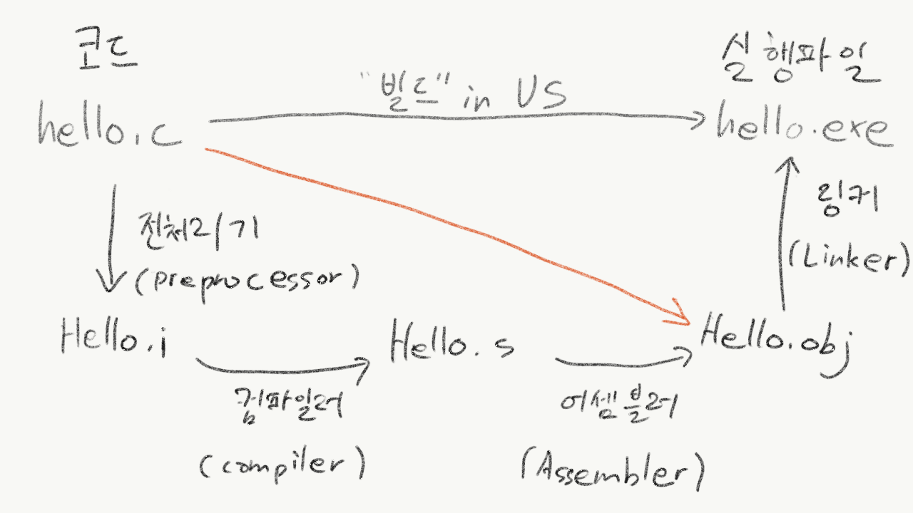

## C언어의 기초
### 왜? 굳이? 처음으로 C언어를 배우나요?
**C언어는 현재 널리 퍼진 다른 언어들의 기반이 된다.**
C언어가 깊게 들어가면 어렵지만 사실 이 이유 하나떄문에 C언어를 먼저 배우기도 한다.
현재 사용하고 있는 언어들은 모두 C언어의 문법(syntax)를 기반으로 만들어졌다.
C언어를 기반으로 학습을 시작하면 C++, C#, Java, Object-C, Python, Javascript등 다른언어를 배울 때 더욱 쉽게 시작할 수 있다.
C언어는 프로그래밍의 기초를 배우기에 적절한 언어이다.

### C언어 프로그램은 어떤 과정으로 돌아가나요?
책에서는 간략하게 2단계로 표현이 되었지만, 더욱 자세한 과정을 사진을 통해 쉽게 이해해보자.
프로그래머는 C언어 코드를 확장자 c 파일(ex. hello.c)에 저장한다.
이를 실행하기 위해서는 실행 파일(ex. hello.exe) 로 변환을 시켜줘야 하는데, Visual Studio에선 이를 '**빌드**한다' 라고 이야기한다.
하지만 빌드 과정 안에는 네가지 단계가 있다.

첫째로, 전처리기 (#include - [HelloWorld.c](HelloWorld.c) 8번째 줄 참고)에 들어있는 헤더 파일(확장자 h 파일 - ~~~.h)을 헤더 파일에 정의된 함수를 사용하기 위해 코드 파일에 추가하게 된다.
이를 도와주는 도구가 '전처리기'(preprocessor)이다.
전처리기를 거치면서 확장자 c 파일이 확장자 i 파일(hello.i)로 바뀐다.
다음으로, 우리가 알고있는 C 언어 코드에서 컴퓨터가 알기 쉽게 코드가 적혀있는 **어셈블리어**로 변환하는 과정을 거친다.
이를 도와주는 도구가 '**컴파일러**'(complier)이다.
컴파일러를 거치면서 확장자 i 파일이 확장자 s 파일(hello.s)로 바뀐다.
이어서, 어셈블리어로 이루어져 있는 확장자 s 파일을 오브젝트 파일 (hello.obj)로 바꾼다.
이를 도와주는 도구가 '어셈블러'(assembler)라고 한다.
마지막으로, 오브젝트 파일을 실행가능한 파일(윈도우에서는 exe 파일)로 바꾸면 실행할수 있다.
이를 도와주는 도구가 '링커'(linker)라고 한다.

사실은 더 자세히 들어가지 않기 위해 책에서도 **어셈블러**(빨간색 화살표)와 **링커**가 존재한다고 적혀있었다. 그렇게 깊숙하게 들어갈 필요는 없다.

혹시나 이해가 되지 않는다면 [여기](http://gracefulprograming.tistory.com/16)를 참고하자.